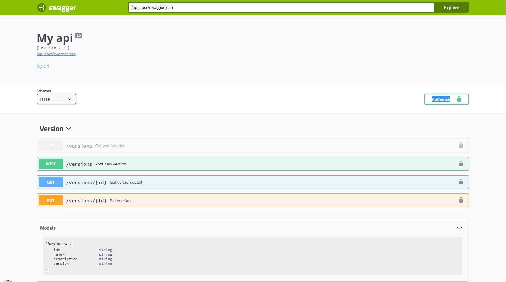

# swagger


Swagger integration module for typescript express inspired from [swagger-express-ts](https://www.npmjs.com/package/swagger-express-ts)

Automatically generate and serve swagger.json v2.0.


## Getting started

First, install [ts-swagger-express](https://github.com/hossamt93/ts-swagger-express.git).

```sh
npm install ts-swagger-express --save
```

### Step 1: configure express

```ts
import * as express from "express";
import * as swagger from "ts-swagger-express";
import swaggerUi from 'swagger-ui-express';
const config = require ( "../config.json" );


// create server
const app = express();


    // generating swagger.json on /api-docs/swagger.json
    app.use(
        swagger.express({
            definition: {
                info: {
                    title: 'swagger Service Api',
                    version: '1.0',
                },
                schemes: ['http', 'https'],
                securityDefinitions: {
                    Bearer: {
                        type: 'apiKey',
                        in: 'header',
                        name: 'Authorization',
                    },
                },
                basePath: '/'
            },
        }),
    );

    // serving swagger ui from swagger.json path
    app.use(
        '/swagger',
        swaggerUi.serve,
        swaggerUi.setup(undefined, {
            swaggerOptions: {
                url: '/api-docs/swagger.json',
            },
        }),
    );


app.listen( config.port );
console.info( "Server is listening on port : " + config.port );

```

### Step 2: Decorate your models

```ts
@ApiModel( {
    description : "Version description" ,
    name : "Version"
} )
export class VersionModel {

    @ApiModelProperty( {
        description : "Id of version" ,
        required : true,
        example: ['123456789']
    } )
    id : number;

    @ApiModelProperty( {
        description : "" ,
        required : true
    } )
    name : string;

    @ApiModelProperty( {
        description : "Description of version" ,
        required : true
    } )
    description : string;
}
```

### Step 3: Decorate your controllers

```ts
@ApiPath({
    path: "/versions",
    name: "Version",
    security: { basicAuth: [] }
})
@controller("/versions")
@injectable()
export class VersionController implements interfaces.Controller {
    public static TARGET_NAME: string = "VersionController";
    
    private data = [{
            id: "1",
            name: "Version 1",
            description: "Description Version 1",
            version: "1.0.0"
        },
        {
            id: "2",
            name: "Version 2",
            description: "Description Version 2",
            version: "2.0.0"
        }];

    @ApiOperationGet({
        description: "Get versions objects list",
        summary: "Get versions list",
        responses: {
            200: { description: "Success", type: SwaggerDefinitionConstant.Response.Type.ARRAY, model: "Version" }
        },
        security: {
            apiKeyHeader: []
        }
    })
    @httpGet("/")
    public getVersions(request: express.Request, response: express.Response, next: express.NextFunction): void {
        response.json(this.data);
    }

    @ApiOperationPost({
        description: "Post version object",
        summary: "Post new version",
        parameters: {
            body: { description: "New version", required: true, model: "Version" }
        },
        responses: {
            200: { description: "Success" },
            400: { description: "Parameters fail" }
        }
    })
    @httpPost("/")
    public postVersion(request: express.Request, response: express.Response, next: express.NextFunction): void {
        if (!request.body) {
            return response.status(400).end();
        }
        this.data.push(request.body);
        response.json(request.body);
    }

}
```

### Step 4: Test

 - Start your server and test swagger.json on url : /api-docs/swagger.json
 - test your swagger ui on url : /swagger



## Project example

You can quickly find plenty of examples on [ts-swagger-express](https://github.com/hossamt93/ts-swagger-express.git) github repository.

- [Installation](./examples/installation.md)
- [Configuration](./examples/configuration.md)
- [@ApiModel](./examples/api-model.decorator.md)
- [@ApiModelProperty](./examples/api-model-property.decorator.md)
- [@ApiPath](./examples/api-path.decorator.md)
- [@ApiOperationGet](./examples/api-operation-get.decorator.md)
- [@ApiOperationPost](./examples/api-operation-post.decorator.md)
- [@ApiOperationPut](./examples/api-operation-put.decorator.md)
- [@ApiOperationPatch](./examples/api-operation-patch.decorator.md)
- [@ApiOperationDelete](./examples/api-operation-delete.decorator.md)

## For any questions, suggestions, or feature requests
- you contanct the author on [Gmail](hossamtaha771@gmail.com)